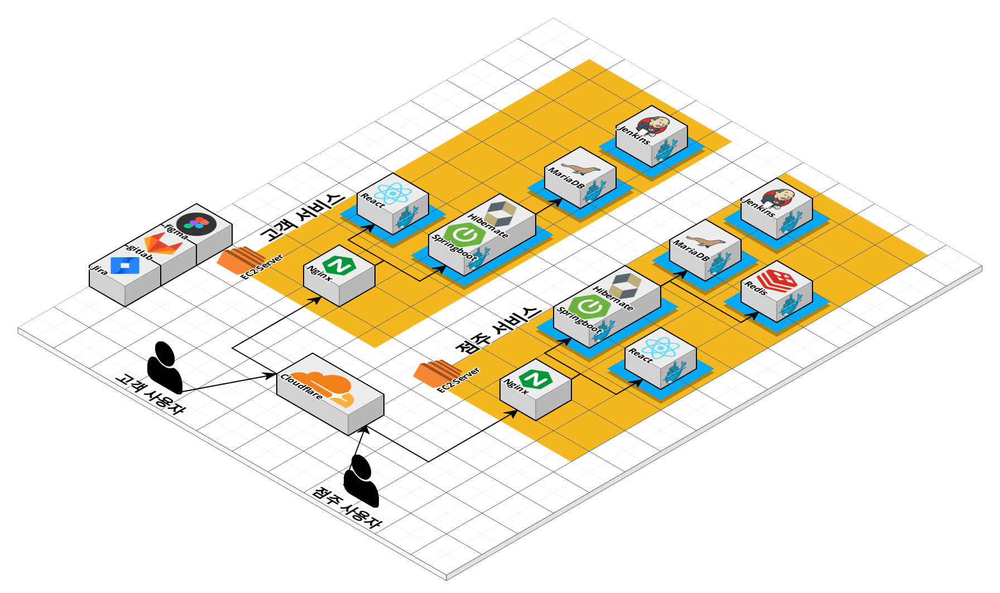
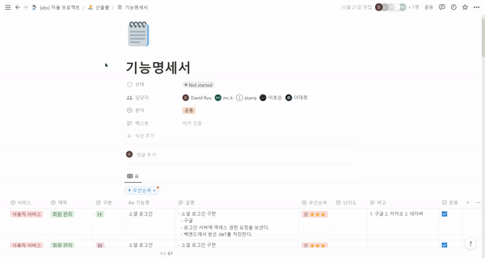
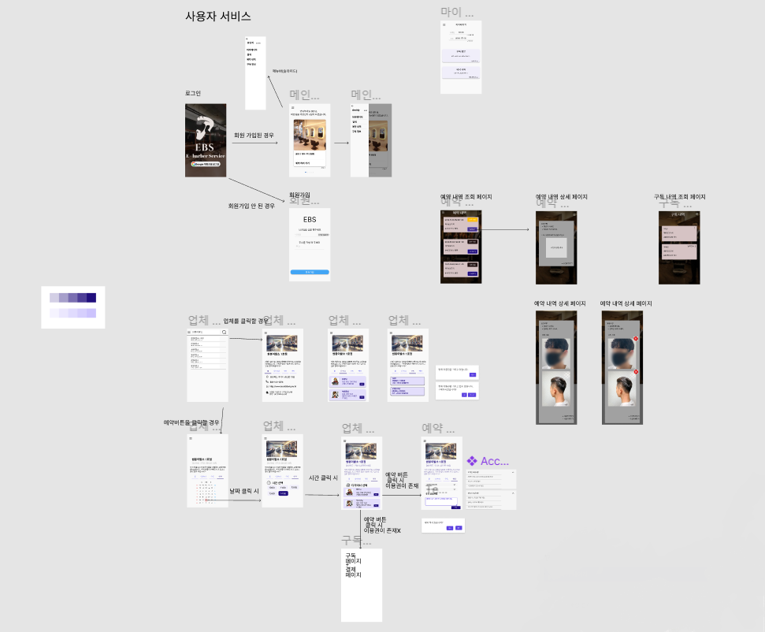
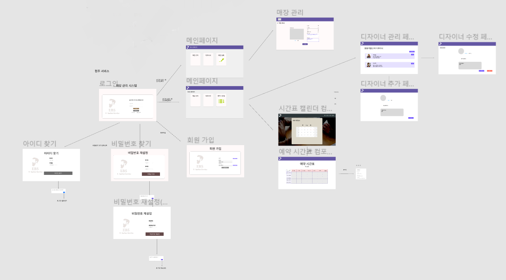
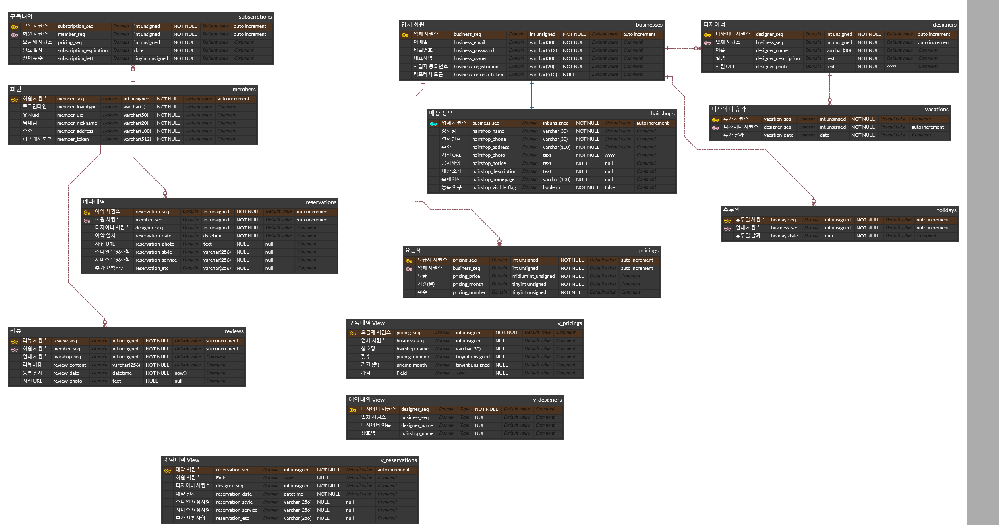
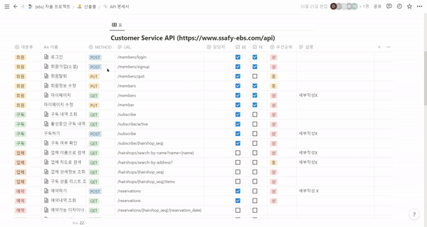
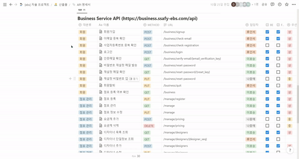

# Contents
1. 🌐EBS란?
2. 📜Description
3. 📺Demonstration
4. 🏗️Architecture
5. 🏁Project Design
6. 🛠️Tech Stacks
7. ⚙️Dev Environment
8. 👥Team

# 🌐EBS란?

---

EBS(E-Barber-service)는 남성 사용자를 대상으로 헤어숍 구독 및 예약 서비스를 제공하는 애플리케이션 입니다. EBS 서비스는 크게 헤어숍 점주가 사용하는 **점주 서비스**와 헤어숍 이용 고객이 사용하는 **고객 서비스**, 두 가지로 구성됩니다. **각 서비스를 별개의 서버로 분리**하여 개발을 진행하였고 EBS 점주 애플리케이션과 EBS 고객 애플리케이션, 두 개의 애플리케이션이 전체 EBS 서비스를 구성하는 하위 애플리케이션에 해당합니다.

# 📜Description

---

### 🗣️ 이용 대상

- **정기적**으로 **단골** 미용실을 이용하는 **남성**

### 🎊 기대 효과

- 고객님은…
    - **구독권**으로 할인된 가격에 ****서비스 이용이 가능해요!
    - 예약할 때 본인의 **요구사항**을 미리 전달할 수 있습니다.
    - 헤어샵 이용후의 **사진을 업로드** 하여 다음 헤어샵 이용에 **참고**할 수 있어요.
- 점주님은…
    - 구독 서비스를 통해 **고정고객**을 유치할 수 있어요!
    - 손님들의 **예약 목록**과 **세부 요청 사항**을 쉽게 확인할 수 있어요

## 📢서비스 주요 기능

### 💇‍♂️고객 서비스

1. 회원 관리
    - 구글 소셜 로그인 API를 통한 **로그인/회원가입**
    - 마이페이지를 통해 **닉네임/주소 변경**
    - **회원 탈퇴**
2. 헤어샵 검색
    - **이름으로 헤어샵 검색** 기능
3. 구독 기능
    - 카카오 정기결제 API를 통한 **구독** 기능
    - 카카오 정기결제 API를 통한 **구독 갱신 취소** 기능
    - **구독내역 확인** 기능
        
        
4. 예약 기능
    - 시간과 디자이너를 선택하여 **예약**하는 기능
    - **예약내역 확인** 기능
    - **시간이 지난** **예약내역에 사진을 업로드**하는 기능

### 💈점주 서비스

1. 회원 관리
    - **회원가입**, **이메일 인증** 및 **로그인**
2. 매장 관리
    - 매장 이름, 소개, 공지사항 등 **정보 수정**
    - 고객이 매장을 검색할 수 있도록 **매장 등록**
3. 디자이너 관리
    - 디자이너 **추가**, **수정**
4. 예약 정보 조회
    - 고객이 예약한 **시각 및 상세 정보 조회**

# 📺Demonstration

동영상

# 🏗️Architecture

---

**EC2 서버 두대**를 이용하였고, **각 서버가 하나의 독립된 서비스**를 할 수 있도록 만들었습니다. 사용자는 **cloudflare** 를 통해 url 에 접근 하고, 고객 사용자는 고객 서비스에, 점주 사용자는 점주 사용자에 접근 하도록 했습니다.

각 서버는 **Nginx** 웹서버를 이용하여 **리버스 프록시**로 프론트와 백을 접근하게 했고 프론트는 **React ,** 백은 **Springboot**를 이용하였습니다. 관련 정보를 저장할 DB는 **mariaDB**를 이용하였고 CI/CD는 **Jenkins**를 통하여 **Git**에 **푸시, 머지**를 했을때 자동배포가 되도록 구현했습니다.

점주 서비스에서는 **Redis** 를 이용하여 이메일 인증시 일정기간동안만 인증번호를 인증 할 수 있도록 하였습니다. 

# 🏁Project Design

## 기능명세서

## 와이어프레임

### 사용자 서비스

### 점주 서비스

## ERD

## API 명세서

### 고객 API

### 점주 API

# 🛠️Tech Stacks

### Backend
     
### DB
 
### Frontend
     
### Etc.
       

# ⚙️Dev Environment

- 링크

# 👥Team

---

### 류인석

개발 파트

- 점주 서비스 백엔드
- 점주 서비스 프론트엔드

구현한 기능

백엔드

- 점주 서비스 로그인 관련 API 구현.
- 점주 서비스 메일 인증 기능 구현.
- 익셉션 핸들러 구현.
- 엑세스 토큰 구현.

프론트엔드

- 고객 서비스 프론트 사진 업로드 기능

후기

- 나름 서비스를 분리하여 구현 해보려고 서버 두개를 썼던점! 호승이가 **Federated** 를 통해서 타 서버의 DB를 볼수 있게끔 구현을 했는데, 나중엔 **Kafka** 라는 기술을 통해 한번 정보를 주고 받도록 구현 해보고 싶다.
- 백엔드 경우 더 **깔끔한 코딩** 하고 싶었는데 그럴만한 시간적 여유가 없었다는것. 클린코딩, 또는 더 좋은 방법의 코딩이 있을까 좀 공부 하고 싶다.

### 이대희

개발 파트

- 인프라
- 고객서비스 프론트엔드
- 고객서비스 백엔드

구현한 기능

- 인프라
    - CI/CD
- 고객 서비스 프론트엔드
    - 정기구독 기능
    - 예약 내역 조회 기능
    - 구독 내역 조회 기능
- 고객 서비스 백엔드
    - 정기구독 기능
    - 예약 기능
    - jwt
- DB
    - ERD 설계

후기

- 좀더 깔끔한 형태로 백엔드 API를 제작하는 방법을 배울 수 있었다.
- 프론트엔드에 대한 경험이 전무하다시피했는데, 이번 기회를 통해서 프론트엔드의 state 관리나 css 적용, axios 이용 등 많은 것들을 배울 수 있었다.
- 구현에 급급해서 코드를 개인적으로 깔끔하게 짜지 못했던 것 같아서 클린코딩에 대한 이해도를 더 높여야겠다는 생각이 들었다.

### 최지상

개발 파트

- 고객 서비스 프론트엔드

구현한 기능

- 고객 서비스 프론트 프로젝트 구조 설계
- 고객 서비스 마이페이지 기능
- 고객 서비스 메인페이지 기능

후기

- 한정된 시간내에서 가용한 자원으로 최선의 결과를 뽑아내는 경험이 된 것 같다.
- 좀 더 다양한 방식으로 UI를 구현하고 싶었는데 시간의 제약으로 그러지 못한점이 아쉽다.

### 이호승

개발 파트

- 백엔드, 프론트엔드, 인프라, DB

구현한 기능

- 백엔드
    - 점주 서비스
        - 디자이너 관리 기능
        - 예약 내역 조회 기능
    - 고객 서비스
        - 사진 업로드 기능
- 프론트엔드
    - 점주 서비스
        - 디자이너 관리 페이지
        - 예약 관리 페이지
    - 고객 서비스
        - 예약 페이지
- DB
    - ERD 설계
    - Federated Engine 설정 및 연결 관리
    - 전체 Data 및 접근 권한 관리
- 인프라
    - NGINX 설정
    - 외부 접근 포트 관리
    - CloudFlare 적용

후기

- 우선 인원 4명만으로 제한된 시간 안에 할 수 있는 최선의 결과를 낸 것 같아서 뿌듯했습니다.
- 팀장님이 기능 명세서 상에서 우선순위를 설정하고 구현할 부분을 단계적으로 지정해 주셔서 프로젝트의 완성도가 더 높아진 것 같아서 고마웠습니다.
- 백엔드 개발 과정에서 에러가 발생했을 때 머릿속으로 생각하는 것만으로 원인을 찾은 게 몇 가지 있었는데 개발 역량이 더 올라간 것 같아서 기분이 좋았던 적도 있었습니다.
- 프론트엔드 개발 능력이 많이 부족해서 한편으로는 능력을 키우고도 싶었고 다른 한편으로는 두려움도 있었는데 React 개발에 참여하면서 두려움을 조금 없앨 수 있었던 기회였다고 생각합니다. 아직 React는 조금 부족하지만 앞으로 더 공부해서 보다 능숙하게 다룰 수 있게 되고 싶습니다.
- Federated Engine 연결을 설정하고 원격 DB 접속 계정이나 권한을 관리하는 등 DB를 전체적으로 관리하면서 DBA 롤을 수행할 수 있었던 것도 좋은 경험이었습니다.